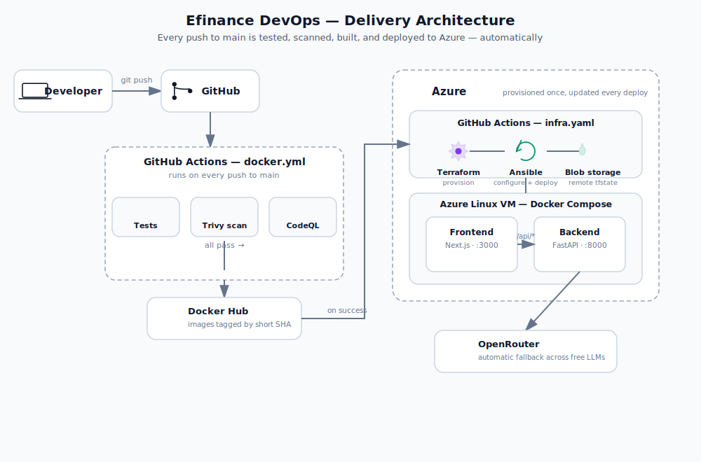

# Efinance DevOps

A CI/CD pipeline built end-to-end around a small AI chatbot: every push to `main` is tested, scanned for vulnerabilities, built into versioned Docker images, and deployed to an Azure VM with no manual steps. The chatbot is the workload used to exercise the pipeline — the pipeline is what this project is actually about.

[Architecture](#architecture) · [Tech Stack](#tech-stack) · [CI/CD Pipeline](#cicd-pipeline) · [Quick Start](#quick-start) · [Remote State Backend](#remote-state-backend) · [Engineering Challenges](#engineering-challenges-solved)

---

## Highlights

- Two independent GitHub Actions pipelines: application delivery (`docker.yml`) and infrastructure/deployment (`infra.yaml`), plus static analysis (`codeql.yml`)
- Immutable, SHA-tagged Docker images — `:latest` is never pushed or deployed
- Trivy scans on both the filesystem (`vuln`, `secret`, `misconfig`) and the built images, on every run
- Infrastructure provisioned with Terraform and configured with Ansible
- Terraform state stored remotely in an Azure Storage Account blob container, not on any local disk or CI runner
- Azure login via OIDC (`azure/login`) — no long-lived cloud credentials stored in GitHub
- Deployment is gated on the upstream test/build pipeline actually succeeding, not just completing
- Automatic per-request LLM fallback across four free OpenRouter models

## Architecture

### Request flow (what the app does at runtime)

```
          +---------------------------------+
          |             Browser             |
          +---------------------------------+
                           |
                           | HTTP :3000
                           v
          +---------------------------------+
          |   Frontend  (Next.js, :3000)    |
          +---------------------------------+
                           |
                           | /api/chat, /api/models
                           v
          +---------------------------------+
          |    Backend  (FastAPI, :8000)    |
          +---------------------------------+
                           |
                           | HTTPS
                           v
          +---------------------------------+
          |           OpenRouter            |
          | (free LLMs, automatic fallback) |
          +---------------------------------+
```

Both boxes above the `HTTPS` arrow run as containers on the same Azure VM. The browser only ever talks to the frontend; the `/api/chat` and `/api/models` calls shown above are Next.js rewrites, proxied server-side to the backend container over Docker's internal bridge network. The browser never sees the backend's address, and no public IP needs to be known at build time.

### Delivery flow (what happens on every push to `main`)



`provision` reads and writes its state from the Azure Blob backend described below — it never touches a local `.tfstate` file on the runner.

## Tech Stack

| Layer | Technology |
|---|---|
| Frontend | Next.js 16 (App Router), React 19, TypeScript, Tailwind CSS |
| Backend | FastAPI, Python 3.13, OpenAI SDK pointed at OpenRouter |
| Containers | Docker, Docker Compose |
| Infrastructure | Terraform (`azurerm` provider), Azure Linux VM, Azure Storage Account (remote state) |
| Configuration | Ansible (`community.docker` collection) |
| CI/CD | GitHub Actions |
| Security | Trivy (filesystem + image scans), CodeQL |
| Testing | pytest (backend), Jest + React Testing Library (frontend) |

## Application

The app itself is intentionally simple — a chat UI backed by free OpenRouter models:

- **`GET /models`** returns the list of available free models and the default.
- **`POST /chat`** tries the requested model first, then falls through the remaining free models in order if the current one returns a rate-limit response (`429` or `RateLimitError`). The response reports which model actually answered and whether a fallback occurred. Any non-rate-limit error is surfaced immediately rather than retried.
- The frontend exposes both a default model and a manual model switcher (`ModelSelector`), backed by a `useChat` hook and a thin `lib/api.ts` client.

Free models currently configured, in fallback order: `gpt-oss-120b`, `gemma-4-31b-it`, `nemotron-3-super-120b`, `gpt-oss-20b`.

## CI/CD Pipeline

### `docker.yml` — test, scan, and publish

Triggered on every push to `main`.

| Job | Does |
|---|---|
| `SCA` | Trivy filesystem scan for vulnerabilities, hardcoded secrets, and misconfigurations |
| `test-backend` | `pytest` against `Backend/tests` |
| `test-frontend` | `jest` against `Frontend/__tests__` |
| `publish` | Builds both images via `docker compose build`, scans each with Trivy, tags them `<user>/ef-frontend:<short-sha>` / `<user>/ef-backend:<short-sha>`, pushes to Docker Hub |
| `report-summary` | Downloads every report artifact, extracts vulnerability/test counts, renders an HTML summary, and emails it — runs regardless of whether earlier jobs passed |

`publish` only runs once `SCA`, `test-backend`, and `test-frontend` have all succeeded, and no image is ever pushed under a `:latest` tag.

### `infra.yaml` — provision and deploy

Split into two jobs so a routine code push doesn't trigger a full infrastructure apply:

| Job | Trigger | Does |
|---|---|---|
| `provision` | manual dispatch, or a push touching `terraform/**` / `ansible/**` | `terraform init/validate/apply` against Azure, via OIDC login |
| `deploy` | every time — after `provision`, or automatically once `docker.yml` finishes | Starts the VM if stopped, waits for it to be reachable over SSH, then runs the Ansible playbook with `image_tag` set to the triggering commit's short SHA |

`deploy` is explicitly gated on the *conclusion* of the triggering `docker.yml` run, not just its completion — a failed test run cannot trigger a deployment of an image that was never pushed.

### `codeql.yml`

GitHub's standard CodeQL analysis, run independently of the Trivy scans above, on push, pull request, and a weekly schedule.

## Repository Structure

```
Efinance_DevOps/
├── Backend/                FastAPI service, tests, Dockerfile
├── Frontend/                Next.js app, tests, Dockerfile
├── terraform/                Azure infrastructure + helper scripts (run/stop/delete VM)
├── ansible/                  Playbook, inventory, production compose file
├── K8s/                      Experimental manifests — not the deployed path, see K8s/README.md
└── .github/workflows/        docker.yml · infra.yaml · codeql.yml
```

## Quick Start

Clone the repository, then move into the project directory (all commands below assume you are in `DevOps_efinance/Efinance_DevOps`, the directory that contains `compose.yaml`):

```bash
git clone https://github.com/Akmal-Esmat/DevOps_efinance.git
cd DevOps_efinance/Efinance_DevOps
```

Create the root-level environment file that `docker compose` reads (still in `Efinance_DevOps`):

```bash
echo "OPENROUTER_API_KEY=your-key-here" > .env
```

Build and start both services:

```bash
docker compose up --build
```

App: `http://localhost:3000` · Backend directly: `http://localhost:8000/models`

Full local setup, environment variables, and troubleshooting → **[DOCKER_README.md](./DOCKER_README.md)**
Kubernetes experiment and its known issue → **[K8s/README.md](./K8s/README.md)**

## Remote State Backend

Terraform's state file (`terraform.tfstate`) tracks every resource this project owns on Azure. It is stored remotely in an Azure Storage Account blob container rather than on a local disk, for two reasons: GitHub Actions runners are ephemeral and would otherwise lose the state after every run, and a remote backend gives Terraform locking so two pipeline runs can't corrupt the state by writing to it at once.

This is configured in `terraform/backend.tf`:

```hcl
terraform {
  backend "azurerm" {
    resource_group_name  = "<resource-group-name>"
    storage_account_name = "<storage-account-name>"
    container_name       = "<container-name>"
    key                  = "terraform.tfstate"
  }
}
```

Terraform cannot create this backend itself — the resource group, storage account, and container have to exist *before* `terraform init` can use them. This is a one-time, manual bootstrap step, done once from the Azure CLI and never repeated by any pipeline. Replace the placeholders below with your own values (they must match `backend.tf` exactly):

Log in to Azure (run from anywhere — this step doesn't depend on the repository):

```bash
az login
```

Create the resource group that will hold the state storage:

```bash
az group create \
  --name <resource-group-name> \
  --location "<azure-region>"
```

Create the storage account inside that resource group (the name must be globally unique across all of Azure):

```bash
az storage account create \
  --name <storage-account-name> \
  --resource-group <resource-group-name> \
  --location "<azure-region>" \
  --sku Standard_LRS \
  --encryption-services blob
```

Create the blob container that will actually hold `terraform.tfstate`:

```bash
az storage container create \
  --name <container-name> \
  --account-name <storage-account-name> \
  --auth-mode login
```

Only after this bootstrap exists does the first `terraform init` succeed. Run it from the `terraform/` directory, inside `Efinance_DevOps`:

```bash
cd Efinance_DevOps/terraform
terraform init
```

From that point on, every `provision` and `deploy` job in `infra.yaml` reads and writes state against this same blob container automatically; nothing about it needs to be repeated.

## Required Secrets

Configured under **Settings → Secrets and variables → Actions**, in the GitHub repository (not from any local directory):

| Secret | Used for |
|---|---|
| `DOCKERHUB_USERNAME` / `DOCKERHUB_TOKEN` | Pushing images to Docker Hub |
| `OPENROUTER_API_KEY` | Backend chat completions, both in CI tests and on the deployed VM |
| `AZURE_CLIENT_ID` / `AZURE_TENANT_ID` / `AZURE_SUBSCRIPTION_ID` | OIDC login to Azure (no stored client secret) |
| `SSH_PRIVATE_KEY` | Ansible's connection to the VM |
| `EMAIL_USERNAME` / `EMAIL_APP_PASSWORD` | Sending the pipeline summary report |

## Engineering Challenges Solved

- **`:latest` race condition.** Out-of-order pipeline runs could let an older build overwrite a newer one. Fixed by tagging every image with the commit's short SHA and never deploying by a mutable tag.
- **Stale containers after a successful image pull.** Docker Compose pulled new images but wouldn't recreate running containers when it saw no configuration diff. Fixed by running Ansible's Docker Compose task with `recreate: always`.
- **Next.js rewrites resolve at build time, not runtime.** An environment-variable-based backend URL worked locally but broke once built, because Next.js bakes rewrite destinations into the compiled output at build time. Fixed by hardcoding the internal Docker service address (`http://backend:8000`), since it's constant across every environment this app runs in.
- **Deployment firing after a failed build.** `workflow_run` fires on any completion, success or failure, so a failing test run could still trigger a deploy attempt for an image that was never pushed. Fixed by explicitly checking `github.event.workflow_run.conclusion == 'success'` before the `deploy` job runs.
- **Dev server vs. production server binding.** Next.js's and FastAPI's development servers default to loopback-only binding inside the container, so Docker's port mapping had nothing to forward to. Fixed by running both containers on their production servers (`next start`, `fastapi run`), which bind all interfaces by default.

## Known Limitations / Roadmap

- `terraform.tfvars` currently commits a real subscription ID directly — should move to a GitHub secret or an untracked `.tfvars`
- The NSG opens ports 22, 3000, and 8000 to any source IP — fine for a graduation-project VM, not for anything beyond that
- No reverse proxy or TLS in front of the app yet; traffic to port 3000/8000 is plain HTTP
- No DNS name for the VM — it's addressed by IP only
- `terraform/scripts/stop_vm.sh` / `run_vm.sh` exist for manual cost control but aren't wired into a workflow yet
- Docker Hub is public; moving to Azure Container Registry would keep images private
- K8s manifests are exploratory only — see [K8s/README.md](./K8s/README.md) for the known pod-networking issue

## License

Not yet added. If you plan to reuse this pipeline, add a `LICENSE` file before relying on it.
